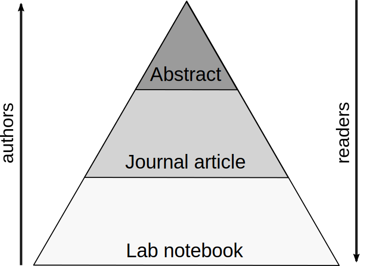
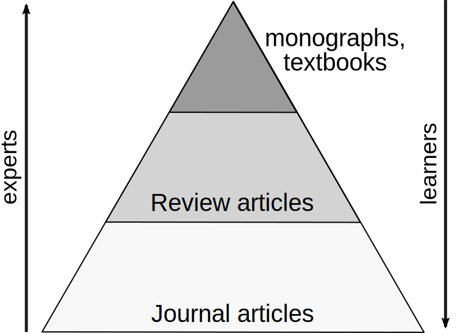
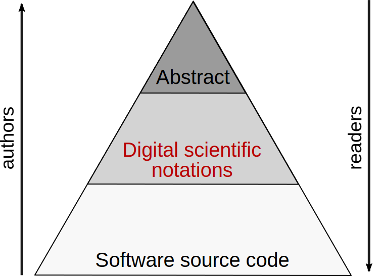

    Title: Knowledge distillation in computer-aided research
    Date: 2018-10-21T18:28:39
    Tags: computational science, computer-aided research, scientific software

There is an important and ubiquitous process in scientific research that scientists never seem to talk about. There isn't even a word for it, as far as I now, so I'll introduce my own: I'll call it *knowledge distillation*.

In today's scientific practice, there are two main variants of this process, one for individual research studies and one for managing the collective knowledge of a discipline. I'll briefly present both of them, before coming to the main point of this post, which is the integration of *digital* knowledge, and in particular software, into the knowledge distillation process.

<!-- more -->

The first variant is performed by individual researchers or closely collaborating teams who, starting from the raw information of their lab notebooks, describing methods applied and results obtained, write a journal article summarizing all of this information into an illustrated narrative that is much easier to digest for their fellow scientists. This narrative contains what the authors consider the essence of their work, leaving out what they consider technical details. Moreover, the narrative places the work into its wider scientific context. In a second step, the authors condense the article into an even smaller abstract, supposed to tell readers at a glance if the article is of interest to them without going into any details. This process can be illustrated as a pyramid:

At the bottom we have all the gory details, one level up the distilled version for communication, and at the top the minimal summary for first contact with a potential reader. It is not uncommon to have an additional layer between the bottom two, often published as "supplementary material".

Whereas authors work from the bottom to the top of this pyramid, readers work down from the top, gaining a more detailed understanding at each step. Until not so long ago, this was a two-step process: after the abstract, they could move on to the paper, but after that they had to contact the authors for obtaining more details, and the authors might well not care to reply. The Open Science movement has made some progress in pushing for more transparency by making deeper information layers available for critical inspection, in particular raw datasets and the source code for the software used to process them. The situation is very much in flux as various scientific disciplines are working out which information can and should be shared, and how. The maximal level of openness is known as [Open Notebook science](https://en.wikipedia.org/wiki/Open-notebook_science), which basically means making the whole pyramid public. Note, however, that giving access to the base of pyramid does not make the knowledge distillation steps superfluous. Readers would succumb to information overload if exposed to all the details without a proper introduction in the form of distilled knowledge. In fact, *most* readers don't want to anything else than the distilled version. 

The second variant of knowledge distillation is performed collectively by domain experts who summarize the literature of their field into review articles and then into monographs or textbooks for students. The pyramid diagram is very similar to the first variant's:

It's really just the same process at another scale: knowledge transfer about a discipline, rather than about a specific study.

So far for good old science - let's move to the digital age. The base of our first pyramid now contains code and digital datasets. Some of the code was written by the authors of the study for this specific project and typically takes the form of scripts, workflows, or notebooks. This is complemented by the dependencies of this project-specific code - see my [post on software collapse](http://blog.khinsen.net/posts/2017/01/13/sustainable-software-and-reproducible-research-dealing-with-software-collapse/) for an analysis of the full software stack. Full openness requires making all of this public, with computational reproducibility serving as a success indicator. If other researchers can re-run the software and get the same results, they possess all the information one could possibly ask for, from a computational point of view.

But as with Open Notebook science, making all the details open is not sufficient. Readers will again succumb to information overload when exposed to a complex software stack and digital datasets whose precise role in the study is not clear. Information overload is even a much more serious problem with software because the amount of detail that software source code contains is orders of magnitude bigger than what can be written down in a lab notebook.

So how do we distill the scientific knowledge embedded in software? The bad news is that we don't yet have any good techniques. What we find in journal articles when it comes to describing computational methods is very brief summaries in plain English, closer to the abstract level than to the journal article level. As a consequence, computational methods remain impenetrable to the reader who does not have prior experience with the software that has been applied. There is no way to work down the pyramid, readers have to acquire the base level skills on their own. Worse, there is no way to stop at the middle level of the pyramid and yet have a clear understanding of what is going on.

The recent years have seen a flurry of research and development concerning the publication of software and computations. One main focus has been the reproducibility of results, another the sustainability of scientific software development, and a third one the readability of computational analyses. This last focus has most notably led to the development of computational notebooks (such as Jupyter, Rmarkdown, Emacs/Org-mode and many more), which embed code and results in a narrative providing context and explanations. Notebooks are occasionally put forward as "the paper of the future", but in view of the knowledge pyramid, that's not what they are. They are closer to the digital age equivalent of lab notebooks, especially when combined with version control to capture the time evolution of their contents. The real paper of the future must contain a *distilled* version of the source code.

It is interesting to examine why notebooks have been so successful in some scientific domains. First of all, they are a much better human-readable presentation of source code than anything we had before, with the exception of the related idea of literate programming which I expect to see a come-back as well. Next, in domains where computational studies tend to be linear sequences of well-known standard operations, such as statistical analyses, the notebook is very similar to a distilled computational protocol, because the technical details are mostly hidden in libraries. These libraries also contain significant scientific knowledge, but because these methods are well-known, they have in a way been distilled in the form of textbooks.

More generally, though, notebooks contain both too little and too much information to qualify as distilled descriptions of computational studies. Too little because much scientific knowledge is hidden in the notebook's dependencies, which are not documented at the same level of readability (which is why I believe that literate programming has a future). Too much because they still expose technical details to the reader that is more a hindrance than a help for understanding.

How, then, should the paper of the future present distilled computational knowledge? I see three main requirements:

 1. It must be possible to explain and discuss individual models, approximations, or algorithms without the constraints of an efficient working implementation.
 2. These models, approximations, and algorithms must be presented in a sufficiently precise form that automatic verification procedures can ensure that the source code at the base level of the pyramid actually implements them.
 3. Suitable user interfaces must allow a reader to explore these models, approximations, and algorithms through concrete examples.
 
The first requirement says that clarity of exposition must take absolute precedence over any technical considerations of software technology. The intrinsic complexity of computational methods makes understanding hard enough, so everything possible must be done to keep accidental complexity out of the way.

The second requirement ensures that the conformity between the distilled and the detailed representations of a computational protocol can be verified by computers rather than by humans. Humans aren't very good at checking that two complex artifacts are equivalent.

The third requirement is motivated by the observation that a real understanding of a computational method, which is usually too lengthy to be actually performed manually, requires both reading code and observing how it processes simple test cases. Observation is not limited to the final outcome, it may well be necessary to provide access to intermediate results.

To get an idea of what "suitable user interfaces" might look like, it's worth looking at the [explorable explanations](https://explorabl.es/) and the [Complexity Explorables](http://www.complexity-explorables.org/) Web sites. Note, however, that none of these exploration user interfaces provide easy access to a precise formulation of the underlying models or algorithm. They exist in the form of JavaScript source code embedded in the Web site, but that's not exactly a reader-friendly medium of expression. Another interesting line of development is happening in the [Pharo](https://pharo.org/) community (Pharo being a modern descendent of Smalltalk), e.g. the idea of [moldable inspectors](http://scg.unibe.ch/research/moldableinspector), which are user interfaces specifically designed to explore a particular kind of object, which in the O-O tradition combines code and data.

Back to requirements 1 and 2: we want a precise and easily inspectable description that can be embedded into an explanatory narrative. We also want to be sure that it actually corresponds to what the user interface lets us explore, and to what the software implementation applies efficiently to real-world problems. I am not aware of any existing technology that can fulfill this role, although there many that were designed with somewhat different goals in mind that can serve as guidelines, in particular the various [modeling](https://en.wikipedia.org/wiki/Modeling_language) and
[specification languages](https://en.wikipedia.org/wiki/Specification_language).

My own research into this problem had led to the concept of [digital scientific notations](http://sjscience.org/article?id=527), and I am currently designing such a notation for physics and chemistry, called [Leibniz](https://github.com/khinsen/leibniz). A [first report](https://peerj.com/articles/cs-158/) on this research has been published earlier this year. Leibniz is mainly inspired by traditional mathematical notation concerning the way it is embedded into a narrative, and from specification languages in terms of semantics. Some relevant features of Leibniz for expressing distilled knowledge are

 - Its highly declarative nature. Leibniz code consists of short declarations that can be written down in (nearly) arbitrary order, making them easy to embed into a narrative, much like mathematical expressions and equations.

 - Its foundation in term rewriting (the same foundation adopted by most computer algebra systems). Among other advantages, this allows Leibniz code to concentrate on one aspect of a model or algorithm while leaving other aspects unspecified.

 - Its restriction to a single universal (but often inefficient) data structure.

These features mainly address requirement 1. As for requirement 2, Leibniz uses XML for its syntax and has very simple semantics, making it easy to write libraries that read and execute Leibniz code which in turn make it easy to integrate Leibniz into scientific software of all kinds. Only Leibniz development environments have to deal with the more complex user-facing syntax requiring a specific parser.

Leibniz does not try to address requirement 3, but since it meets requirement 2, it doesn't get in the way of people wishing to build exploration and inspection user interfaces for Leibniz-based models and algorithms.

Leibniz is still very much experimental, and I am not at all sure that it will turn out to be useful in its current form. In fact, I am almost certain that it will require modification to be of practical use. If that doesn't scare you off, have a look at the [example collection](http://khinsen.net/leibniz-examples/) to get an idea of what Leibniz can do and what it looks like. Feedback of any kind is more than welcome!
